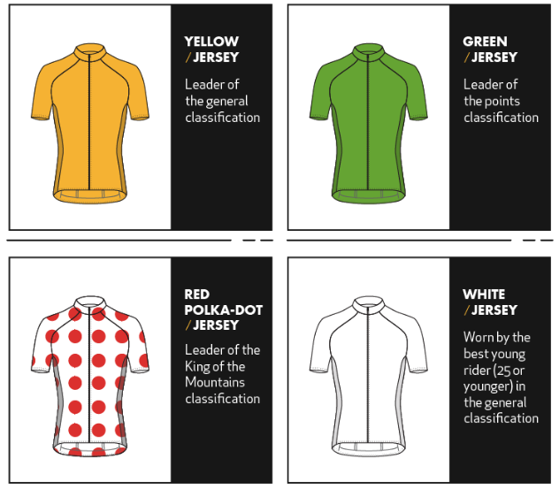
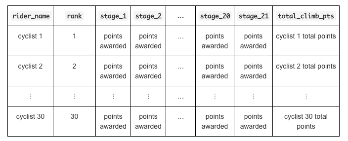

# STA 323 :: Exam 1

## Introduction

The Tour de France is a multi-stage bike race held annually in July. The race
has riders primarily cycle throughout French cities, countrysides, and 
mountains. It is considered one of the toughest endurance events in the world.
Participants will cover over 3,300 kilometers in a 23-day span.

Cycling is both a team and individual sport. Riders are members of teams, but
there are individual accolades up for grabs. Riders in first with regards
to these individual award categories wear special colored / patterned jerseys.


- Overall winner (as determined by time): yellow jersey
- Best sprinter (as determined by points): green jersey
- King of the mountains / best climber (as determined by points): polka dot jersey
- Best young rider (as determined by time): white jersey 

<center>

</center>


## Data

Data in your repository is from the 2019 Tour de France. To get started, read in 
`tdf_2019.rds` and create an object `tdf` with

```r
tdf <- readRDS(file = "data/tdf_2019.rds")
```

Most of the variables are self-explanatory. The data should be clean and
organized; maybe not in the form you want, but I did not add any issues as 
I did in Homework 4. Below are a few details on the data.

1. Time is expressed in hours:minutes.seconds.
2. Only the winning rider (team) in a stage has a real time, the time
   for others are relative to the winner's and formatted as "+hh:mm.ss".
3. `sprint` and `climber` are the number of points a rider earned in the stage
   for that respective category.
   
## Tasks

You may use any R package. Include code to load your package with 
`library(package_name)`. If I do not have the package, I will install it.

#### Task 1

Use object `tdf` to create a tidy data frame called `tdf_clean`
that contains the following
variables. Each variable should be of the specified type given in parentheses.

* `stage` - stage of the Tour **(integer)**
* `rider_name` - full name of the cyclist, no need to change the format **(character)**
* `rider_nat` - cyclist's nationality **(character)**
* `team_name` - cyclist's team name **(character)**
* `team_nat` - cyclist's team nationality **(character)**
* `dep_city` - departure city for given stage **(character)**
* `arr_city` - arrival city for given stage **(character)**
* `classification` - stage's classification **(character)**
* `distance` - stage's distance that cyclists will ride **(double)**
* `start_date` - stage's start date, not the time **(date)**
* `time` - cyclist's time or relative time on a given stage **(character)**
* `time_rank` - rank of cyclist as given in the stage **(integer)**
* `sprint_pts` - sprint points earned by cyclist on given stage **(double)**
* `sprint_rank` - rank of cyclist based on sprint points within stage **(integer)**
* `climb_pts` - climb points earned by cyclist on given stage **(double)**
* `climb_rank` - rank of cyclist based on climb points within stage **(integer)**
* `young_rider_time` - young rider time on a given stage **(character)**
* `young_rider_rank` - rank of cyclist based on young rider time within stage **(integer)**

If a variable's value is missing, code it as `NA`. For example, some cyclists 
may have values `dns`, `dnf`, or `dq` if they did not start,
did not finish, or were disqualified, respectively. 
Similarly, most riders will not have climb points and a climb 
rank since only a few points are up for grabs in a given stage; riders missing 
these values should also have `NA` for the respective variable's value.

Create a folder in your repo called `results`. Save `tdf_clean` as an object
in folder `results` with the below code.

```r
saveRDS(tdf_clean, "results/tdf_clean.rds")
```

<br/>

#### Task 2

1. Fix the time variables (`time`, `young_rider_time`) in your tidy data frame
   so each cyclist's 
   stage time is given rather than just the winner's time and time back from 
   the winner. For example, rather than
   `"04:22.47", "+00:00.00", "+00:00.00", "+00:00.00", ...` in stage 1, it
   should be changed to
   `"04:22.47", "04:22.47", "04:22.47", "04:22.47", ...`. You may keep the
   result as type character or change it to a reasonable date/time data type.
   
2. Use the data frame (either from Task 1 or after you fixed the times above)
   to create a data frame that showcases the King of the Mountains competition
   across the 21 stages. To give you an idea of what it should like in a 
   tabular form see below.
   <br/><br/>
    
   <br/><br/>
Only include the top 30 climbers sorted by `total_climb_points` in your final 
data frame. You may decide how to account for ties. Explain your choice.
<br/><br/>
If a cyclist did not accumulate any points in a given stage, 
set the value to 0. Variable `rider_name` should be of type character. All
other variables should be of type numeric.

<br/>

#### Task 3

Use the data to construct a single visualization that 
depicts something about the 2019 Tour de France. A single visualization can
include subplots, but I do not want, for example, 10 unrelated graphics. Your
visualization should be well-polished with a title that tells a story, and
aesthetics, font size, and style should be carefully chosen. 
You may construct this visualization with the mindset
that it would appear in a presentation. Thus, animations are okay to utilize.

<br/>

## Essential details

#### Deadline and submission

**The deadline to submit Exam 1 is 5:00pm on Friday, March 6.** 
Only the code in the master branch will be graded.

#### Rules

**Phase I**: Data understanding, Friday, Feb 28 at 5:00pm - Monday, Mar 
             2 at 5:00pm

**Phase II**: Tasks, Monday, Mar 2 at 5:00pm - Friday, Mar 6 at 5:00pm

- This is an individual assignment.

- Everything in your repository is for your eyes only except for the 
  instructor and TAs.

- You may not communicate anything about this exam to anyone.

- You may use any online, book, and note resources. As always, you must cite 
  any code you use as inspiration.

- During Phase I, post any questions about the data to channel #exam1 on Slack. 
  During Phase II, only send direct messages to the instructor on Slack. 
  Questions should only be about understanding the data or the exam's 
  instructions.

#### git / GitHub

You will only have one branch to start with in your repository - master. 
You may create other branches as needed, but only your work in the master 
branch will be graded. Be sure to push your work before the deadline.

#### Academic integrity

This is an individual assignment. See the Rules section above.
As a reminder, any code you use directly or as inspiration must be cited.

To uphold the Duke Community Standard:

- I will not lie, cheat, or steal in my academic endeavors;
- I will conduct myself honorably in all my endeavors; and
- I will act if the Standard is compromised.

#### Grading

A portion of the total points for each task will be allocated towards
efficiency and code style. The most important thing is that you get the
correct result.

**Topic**|**Points**
---------|----------:|
Task 1   |  20
Task 2.1 |   7
Task 2.2 |  13
Task 3   |  20
**Total**|**60**

*Documents that fail to knit after minimal intervention will receive a 0*.