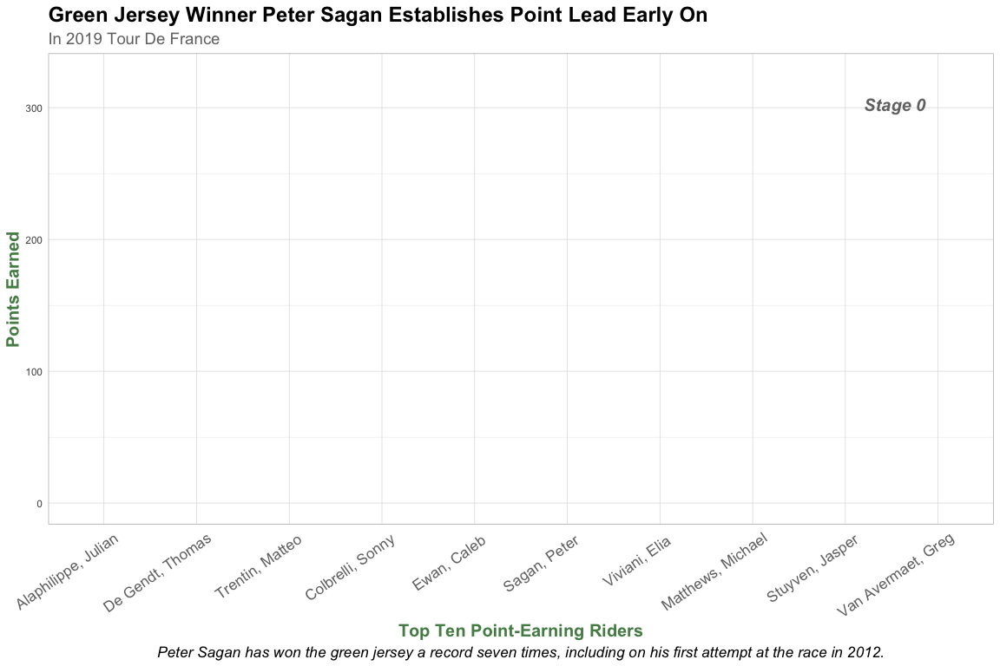

## Packages


```r
library(tidyverse)
library(purrr)
library(dplyr)
library(lubridate)
library(stringr)
library(ggplot2)
library(gganimate)
library(patchwork)
```

## Data


```r
tdf <- readRDS(file = "data/tdf_2019.rds")
```

## Task 1


```r
compile_stage <- function(n){
  # Store relevant details for each of the 21 stages
  stage_info <- data.frame(tdf[[n]]$stage) %>%
    select(description:single_event)
  
  # Store information on each competitor
  people <- lapply(tdf[[n]]$stage$competitors, data.frame) %>%
    bind_rows() %>%
    # Add a column which will identify observations by stage number
    mutate(description = (str_c("Stage ", n)))
  
  # Store information on each team
  team_info <- lapply(tdf[[n]]$stage$teams, data.frame) %>%
    bind_rows() %>%
    rename(team.id = id)
  
  # Add team info for each competitor by joining competitor and team observations by team id
  people_teams <- full_join(people, team_info, by = "team.id")
  
  # Add stage info for each competitor by joining competitor and stage observations by stage number
  whole_stage <- full_join(people_teams, stage_info, by = "description") 

  return (whole_stage)
}

# Apply compile_stage function to every stage and compile into a dataframe
messy_tdf <- lapply(1:21, compile_stage) %>%
  rbind_list()
```


```r
# Rename and keep only relevant variables
messy_tdf <- messy_tdf %>%
  select(stage = description, rider_name = name.x, rider_nat = nationality.x, team_name = team.name, team_nat = team.nationality, dep_city = departure_city, arr_city = arrival_city, classification, distance, start_date = scheduled, time = result.time, time_rank = result.time_ranking, sprint_pts = result.sprint, sprint_rank = result.sprint_ranking, climb_pts = result.climber, climb_rank = result.climber_ranking, young_rider_time = result.young_rider, young_rider_rank = result.young_rider_ranking)
```


```r
tdf_clean <- messy_tdf %>%
  mutate(stage = as.integer(str_extract(stage, "\\d.*")),
         distance = as.numeric(str_replace(distance, ",", ".")), 
         # Remove extra time information from start date value
         start_date = date(str_extract(start_date, "\\d{4}-\\d{2}-\\d{2}")),
         time_rank = as.integer(time_rank), 
         # One cyclist was mistakenly recorded with negative points
         sprint_pts = abs(as.numeric(sprint_pts)),
         sprint_rank = as.integer(sprint_rank),
         climb_pts = as.numeric(climb_pts),
         climb_rank = as.integer(climb_rank),
         young_rider_rank = as.integer(young_rider_rank)
         )
```


```r
glimpse(tdf_clean)
```

```
Observations: 3,696
Variables: 18
$ stage            <int> 1, 1, 1, 1, 1, 1, 1, 1, 1, 1, 1, 1, 1, 1, 1, 1, 1, 1…
$ rider_name       <chr> "Teunissen, Mike", "Sagan, Peter", "Ewan, Caleb", "N…
$ rider_nat        <chr> "Netherlands", "Slovakia", "Australia", "Italy", "It…
$ team_name        <chr> "Team Jumbo - Visma", "Bora - Hansgrohe", "Lotto Sou…
$ team_nat         <chr> "Netherlands", "Germany", "Belgium", "South Africa",…
$ dep_city         <chr> "Brussels", "Brussels", "Brussels", "Brussels", "Bru…
$ arr_city         <chr> "Brussels", "Brussels", "Brussels", "Brussels", "Bru…
$ classification   <chr> "Flat", "Flat", "Flat", "Flat", "Flat", "Flat", "Fla…
$ distance         <dbl> 194.5, 194.5, 194.5, 194.5, 194.5, 194.5, 194.5, 194…
$ start_date       <date> 2019-07-06, 2019-07-06, 2019-07-06, 2019-07-06, 201…
$ time             <chr> "04:22.47", "+00:00.00", "+00:00.00", "+00:00.00", "…
$ time_rank        <int> 1, 2, 3, 4, 5, 6, 7, 8, 9, 10, 11, 12, 13, 14, 15, 1…
$ sprint_pts       <dbl> 50, 50, 20, 18, 33, 27, 23, 10, 8, 7, 21, 5, 4, 3, 2…
$ sprint_rank      <int> 1, 2, 7, 8, 3, 4, 5, 9, 12, 14, 6, 17, 19, 21, 23, 2…
$ climb_pts        <dbl> NA, NA, NA, NA, NA, NA, NA, NA, NA, NA, 2, NA, NA, N…
$ climb_rank       <int> NA, NA, NA, NA, NA, NA, NA, NA, NA, NA, 2, NA, NA, N…
$ young_rider_time <chr> NA, NA, "04:22.47", NA, NA, NA, NA, NA, NA, NA, NA, …
$ young_rider_rank <int> NA, NA, 1, NA, NA, NA, NA, NA, NA, NA, NA, NA, NA, N…
```


```r
saveRDS(tdf_clean, "results/tdf_clean.rds")
```

## Task 2

### Part 1


```r
# Function to convert character string to a double representing the amount of time in seconds only
convert_seconds <- function(time) {
  time <- str_remove(time, "\\+")
  minutes <- as.numeric(str_extract(time, "\\d{2}"))
  seconds <- str_extract(time, ":\\d{2}\\.") %>%
    str_extract(., "\\d{2}") %>%
    as.numeric()
  milliseconds <- str_extract(time, "\\.\\d{2}") %>%
    str_extract(., "\\d{2}") %>%
    as.numeric()
  time_in_seconds <- 60 * minutes + seconds + milliseconds / 100
  
  return (time_in_seconds)
}

# Apply function to convert all time values in tdf_clean to seconds
tdf_clean <- tdf_clean %>%
  mutate(time = convert_seconds(time),
         young_rider_time = convert_seconds(young_rider_time))
```


```r
# Create dataset of winning times for each stage
winning_times <- tdf_clean %>%
filter(time_rank == 1) %>%
select(stage, time)

# Add NA as winning time for stages 2 and 19, team trials where no rider was ranked first
two <- c(stage = 2, time = NA)
nineteen <- c(stage = 19, time = NA)

winning_times <- rbind_list(winning_times, two, nineteen) %>%
  arrange(stage)

# Repeat for young rider times
yr_winning_times <- tdf_clean %>%
filter(young_rider_rank == 1) %>%
select(stage, young_rider_time)

yr_two <- c(stage = 2, young_rider_time = NA)
yr_nineteen <- c(stage = 19, young_rider_time = NA)

yr_winning_times <- rbind_list(yr_winning_times, yr_two, yr_nineteen) %>%
  arrange(stage)
```


```r
# Function to take data for a stage and add winning time to all other times, converting from relative to absolute
make_time_absolute <- function(n){
  updated_stage_df <- tdf_clean %>%
    filter(stage == n) %>%
    mutate(time = case_when(
      time_rank == 1 ~ time,
      time_rank != 1 ~ winning_times[[n, 2]] + time,
      TRUE ~ time
    ))
  return (updated_stage_df)
}

# Apply time fixing function to every stage
tdf_clean <- lapply(1:21, make_time_absolute) %>%
  rbind_list()
```


```r
# Function to take data for a stage and add winning young rider time to all other times, converting from relative to absolute
make_yr_time_absolute <- function(n){
  updated_stage_df <- tdf_clean %>%
    filter(stage == n) %>%
    mutate(young_rider_time = case_when(
      young_rider_rank == 1 ~ young_rider_time,
      young_rider_rank != 1 ~ yr_winning_times[[n, 2]] + young_rider_time,
      TRUE ~ young_rider_time
    ))
  return (updated_stage_df)
}

# Apply young rider time fixing function to every stage
tdf_clean <- lapply(1:21, make_yr_time_absolute) %>%
  rbind_list()
```


```r
tdf_clean <- tdf_clean %>%
  # After adding times (in seconds) to obtain absolute times, convert back to date/time type 'period'
  mutate(time = round(seconds_to_period(time), 2),
         young_rider_time = round(seconds_to_period(young_rider_time), 2))
```


```r
tdf_clean %>%
  select(time, young_rider_time) %>%
  glimpse()
```

```
Observations: 3,696
Variables: 2
$ time             <Period> 4M 22.47S, 4M 22.47S, 4M 22.47S, 4M 22.47S, 4M 22…
$ young_rider_time <Period> NA, NA, 4M 22.47S, NA, NA, NA, NA, NA, NA, NA, NA…
```

### Part 2


```r
# Set climb points NAs equal to 0 (to allow for calculating total points later on)
mountains <- tdf_clean %>%
  select(stage, rider_name, climb_pts) %>%
  mutate(climb_pts = case_when(
    is.na(climb_pts) ~ 0,
    TRUE ~ climb_pts
  ),
  stage = str_c("stage_", stage))

mountains <- pivot_wider(mountains, id_cols = rider_name, names_from = stage, values_from = climb_pts)
```


```r
mountains <- mountains %>%
  # Sum columns to obtain total climb points
  mutate(total_climb_pts = select(., stage_1:stage_21) %>% 
           rowSums()) %>%
  # Keep top 30 climbers
  arrange(desc(total_climb_pts)) %>%
  head(30)
```


```r
# Added rank, giving tied riders the same rank
mountain_king <- mountains %>%
  mutate(rank = rank(-total_climb_pts, ties.method = "min"))
```


```r
# Reorder columns for display
mountain_king <- mountain_king[,c(1, 24, 2:23)]

# All columns except name should be doubles
mountain_king <- mountain_king %>%
  mutate(rank = as.numeric(rank))
```


```r
glimpse(mountain_king)
```

```
Observations: 30
Variables: 24
$ rider_name      <chr> "Bardet, Romain", "Bernal, Egan", "Wellens, Tim", "Ca…
$ rank            <dbl> 1, 2, 3, 4, 5, 5, 7, 8, 9, 10, 11, 12, 13, 14, 15, 16…
$ stage_1         <dbl> 0, 0, 0, 0, 0, 0, 0, 0, 0, 0, 0, 0, 0, 0, 0, 0, 0, 0,…
$ stage_2         <dbl> 0, 0, 0, 0, 0, 0, 0, 0, 0, 0, 0, 0, 0, 0, 0, 0, 0, 0,…
$ stage_3         <dbl> 0, 0, 7, 0, 0, 0, 1, 0, 0, 0, 0, 0, 0, 0, 1, 0, 0, 0,…
$ stage_4         <dbl> 0, 0, 0, 0, 0, 0, 0, 0, 0, 0, 0, 0, 0, 0, 0, 0, 0, 0,…
$ stage_5         <dbl> 0, 0, 10, 0, 0, 0, 0, 0, 0, 0, 0, 0, 0, 0, 0, 0, 0, 0…
$ stage_6         <dbl> 0, 0, 26, 0, 0, 0, 0, 2, 0, 0, 0, 0, 8, 4, 1, 0, 30, …
$ stage_7         <dbl> 0, 0, 0, 0, 0, 0, 0, 0, 0, 0, 0, 0, 0, 0, 0, 0, 0, 0,…
$ stage_8         <dbl> 0, 0, 0, 0, 0, 0, 0, 0, 0, 0, 0, 0, 29, 0, 1, 0, 0, 0…
$ stage_9         <dbl> 0, 0, 0, 0, 0, 0, 0, 0, 0, 0, 0, 0, 0, 0, 0, 0, 0, 0,…
$ stage_10        <dbl> 0, 0, 0, 0, 0, 0, 0, 0, 0, 0, 0, 0, 0, 0, 0, 0, 0, 0,…
$ stage_11        <dbl> 0, 0, 0, 0, 0, 0, 0, 0, 0, 0, 0, 0, 0, 0, 0, 0, 0, 0,…
$ stage_12        <dbl> 0, 0, 11, 0, 0, 10, 0, 0, 0, 0, 0, 0, 0, 0, 0, 0, 0, …
$ stage_13        <dbl> 0, 0, 0, 0, 0, 0, 0, 0, 0, 0, 0, 0, 0, 0, 0, 0, 0, 0,…
$ stage_14        <dbl> 0, 16, 10, 0, 9, 0, 0, 40, 0, 24, 12, 20, 0, 4, 30, 0…
$ stage_15        <dbl> 18, 2, 0, 0, 3, 19, 1, 8, 5, 0, 6, 4, 0, 0, 0, 7, 0, …
$ stage_16        <dbl> 0, 0, 0, 0, 0, 0, 0, 0, 0, 0, 0, 0, 0, 0, 0, 0, 0, 0,…
$ stage_17        <dbl> 0, 0, 0, 0, 0, 0, 0, 0, 0, 0, 0, 0, 1, 0, 0, 0, 0, 0,…
$ stage_18        <dbl> 68, 0, 10, 60, 0, 0, 56, 0, 40, 0, 0, 0, 0, 0, 0, 24,…
$ stage_19        <dbl> 0, 40, 0, 7, 7, 30, 0, 0, 0, 16, 0, 8, 0, 12, 0, 0, 0…
$ stage_20        <dbl> 0, 20, 0, 0, 40, 0, 0, 0, 0, 4, 24, 8, 0, 16, 0, 0, 0…
$ stage_21        <dbl> 0, 0, 1, 0, 0, 0, 0, 0, 0, 0, 0, 0, 0, 0, 0, 0, 0, 0,…
$ total_climb_pts <dbl> 86, 78, 75, 67, 59, 59, 58, 50, 45, 44, 42, 40, 38, 3…
```

I decided to account for ties using the "minimum" method of function `rank()`, a technique commonly used in sports. As an example of how this works, if two competitors tie for 5th place, they will both receive rank 5, and the next competitor will receive rank 7, skipping over 6th place. This way, the ranks of competitors following ties are not unduly inflated, and competitors within tied groups are not arbitrarily or randomly assigned rankings.

## Task 3


```r
# Change NAs to 0s for point values
tdf_plot <- tdf_clean %>%
  mutate(stage = str_c("stage_", stage),
         sprint_pts = case_when(
    is.na(sprint_pts) ~ 0,
    TRUE ~ sprint_pts
  ), 
  climb_pts = case_when(
    is.na(climb_pts) ~ 0,
    TRUE ~ climb_pts
  )) %>%
  # Add sprint points and climb points for total points
  mutate(total_pts = select(., c(sprint_pts, climb_pts)) %>%
           rowSums())
```


```r
# Simplify to include only relevant variables
tdf_plot <- tdf_plot %>%
  select(rider_name, stage, sprint_pts, climb_pts, total_pts)

tdf_points <- pivot_wider(tdf_plot, id_cols = rider_name, names_from = stage, values_from = total_pts)

# Focus on the ten riders who earned the most total points
tdf_points <- tdf_points %>%
  mutate(all_pts = select(., stage_1:stage_21) %>% 
           rowSums()) %>%
  arrange(desc(all_pts)) %>%
  head(10)
```


```r
# Mutate data so the point total at each stage represents cumulative points rather than points earned in that stage
tdf_points_cumulative <- tdf_points %>%
    mutate(stage_0 = 0,
           stage_2 = select(., stage_1:stage_2) %>%
             rowSums(),
           stage_3 = select(., stage_1:stage_3) %>%
             rowSums(),
           stage_4 = select(., stage_1:stage_4) %>%
             rowSums(),
           stage_5 = select(., stage_1:stage_5) %>%
             rowSums(),
           stage_6 = select(., stage_1:stage_6) %>%
             rowSums(),
           stage_7 = select(., stage_1:stage_7) %>%
             rowSums(),
           stage_8 = select(., stage_1:stage_8) %>%
             rowSums(),
           stage_9 = select(., stage_1:stage_9) %>%
             rowSums(),
           stage_10 = select(., stage_1:stage_10) %>%
             rowSums(),
           stage_11 = select(., stage_1:stage_11) %>%
             rowSums(),
           stage_12 = select(., stage_1:stage_12) %>%
             rowSums(),
           stage_13 = select(., stage_1:stage_13) %>%
             rowSums(),
           stage_14 = select(., stage_1:stage_14) %>%
             rowSums(),
           stage_15 = select(., stage_1:stage_15) %>%
             rowSums(),
           stage_16 = select(., stage_1:stage_16) %>%
             rowSums(),
           stage_17 = select(., stage_1:stage_17) %>%
             rowSums(),
           stage_18 = select(., stage_1:stage_18) %>%
             rowSums(),
           stage_19 = select(., stage_1:stage_19) %>%
             rowSums(),
           stage_20 = select(., stage_1:stage_20) %>%
             rowSums(),
           stage_21 = select(., stage_1:stage_21) %>%
             rowSums()) %>%
  select(-all_pts)

# Reorder the way tdf_points_cumulative will display
tdf_points_cumulative <- tdf_points_cumulative[,c(1, 23, 2:22)]
```


```r
# Pivot data to allow for plotting by stage
tdf_points_cumulative <- pivot_longer(tdf_points_cumulative, -rider_name, names_to = "stage", values_to = "points")

# Mutate stage so it will be ordered numerically, not alphabetically, in the animation
tdf_points_cumulative <- tdf_points_cumulative %>%
  mutate(stage = as.numeric(str_extract(stage, "\\d+")))
```


```r
# Relevel rider names so that bars of plot will slope downward from center
tdf_points_cumulative <- tdf_points_cumulative %>%
  mutate(rider_name = fct_relevel(rider_name, "Alaphilippe, Julian", "De Gendt, Thomas", "Trentin, Matteo", "Colbrelli, Sonny", "Ewan, Caleb", "Sagan, Peter", "Viviani, Elia", "Matthews, Michael", "Stuyven, Jasper", "Van Avermaet, Greg"),
         sagan = case_when(
           rider_name == "Sagan, Peter" ~ "Y",
           TRUE ~ "N"
         ))

# Set colors so Sagan's bar will appear green
cols <- c("Y" = "lightgreen", "N" = "gray31")
```


```r
# Make animated plot of points earned by stage
ggplot(tdf_points_cumulative, aes(x = rider_name, y = points, fill = sagan)) + 
  geom_bar(stat = "identity") +
  theme_light() +
  theme(plot.title = element_text(size = 18, face = "bold"),
        plot.subtitle = element_text(color = "gray45", size = 14),
        plot.caption = element_text(size = 13, face = "italic", hjust = .5),
        plot.tag = element_text(color ="gray45", size = 15, face = "bold.italic"),
        axis.title.x = element_text(color = "palegreen4", size = 15, face = "bold"),
        axis.title.y = element_text(color = "palegreen4", size = 15, face = "bold"),
        axis.text.x = element_text(color = "gray45", size = 13, angle = 35, hjust = .9, vjust = .9),
        legend.position = "none", 
        axis.ticks = element_blank(), 
        plot.tag.position = c(0.9, 0.85)) +
  ylim(0, 325) +
  scale_fill_manual(values = cols) +
  labs(title = "Green Jersey Winner Peter Sagan Establishes Point Lead Early On", subtitle = "In 2019 Tour De France", tag = "Stage {closest_state}", x = "Top Ten Point-Earning Riders", y = "Points Earned", caption = "Peter Sagan has won the green jersey a record seven times, including on his first attempt at the race in 2012.") +
  transition_states(stage, transition_length = 5, state_length = 3) +
  ease_aes('linear')
```

<!-- -->

## References 

Inspiration for row summing:
https://stackoverflow.com/questions/29006056/efficiently-sum-across-multiple-columns-in-r

Inspiration for rank function:
https://www.rdocumentation.org/packages/base/versions/3.6.2/topics/rank

Inspiration for animated bar graph:
https://www.r-graph-gallery.com/288-animated-barplot-transition.html

Inspiration for rbind_list and lapply technique (which I first used in Hw 4):
Lapply technique from:
Florian, Post #2 on https://stackoverflow.com/questions/45452015/how-to-convert-list-of-list-into-a-tibble-dataframe

Used rbind_list as an alternative to do.call(rbind, dfs):
https://www.rdocumentation.org/packages/dplyr/versions/0.3.0.2/topics/rbind_list
