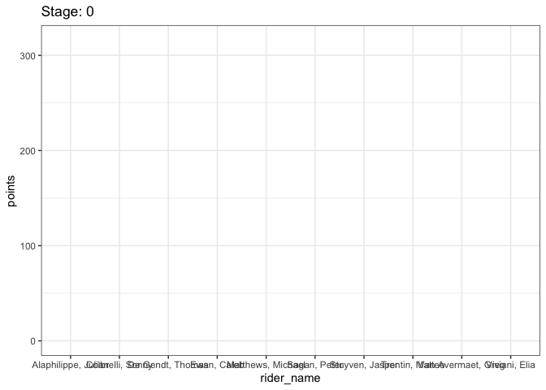

## Packages


```r
library(tidyverse)
library(purrr)
library(dplyr)
library(lubridate)
library(stringr)
library(ggplot2)
library(gganimate)
library(patchwork)
```

## Data


```r
tdf <- readRDS(file = "data/tdf_2019.rds")
```

## Task 1


```r
compile_stage <- function(n){
  stage_info <- data.frame(tdf[[n]]$stage) %>%
    select(description:single_event)
  
  people <- lapply(tdf[[n]]$stage$competitors, data.frame) %>%
    bind_rows() %>%
    mutate(description = (str_c("Stage ", n)))
  
  team_info <- lapply(tdf[[n]]$stage$teams, data.frame) %>%
    bind_rows() %>%
    rename(team.id = id)
  
  people_teams <- full_join(people, team_info, by = "team.id")
  
  whole_stage <- full_join(people_teams, stage_info, by = "description") 

  return (whole_stage)
}

messy_tdf <- lapply(1:21, compile_stage) %>%
  rbind_list()
```


```r
messy_tdf <- messy_tdf %>%
  select(stage = description, rider_name = name.x, rider_nat = nationality.x, team_name = team.name, team_nat = team.nationality, dep_city = departure_city, arr_city = arrival_city, classification, distance, start_date = scheduled, time = result.time, time_rank = result.time_ranking, sprint_pts = result.sprint, sprint_rank = result.sprint_ranking, climb_pts = result.climber, climb_rank = result.climber_ranking, young_rider_time = result.young_rider, young_rider_rank = result.young_rider_ranking)
```


```r
tdf_clean <- messy_tdf %>%
  mutate(stage = as.integer(str_extract(stage, "\\d.*")),
         distance = as.numeric(str_replace(distance, ",", ".")), 
         start_date = date(str_extract(start_date, "\\d{4}-\\d{2}-\\d{2}")),
         time_rank = as.integer(time_rank), 
         # One cyclist was mistakenly recorded with negative points
         sprint_pts = abs(as.numeric(sprint_pts)),
         sprint_rank = as.integer(sprint_rank),
         climb_pts = as.numeric(climb_pts),
         climb_rank = as.integer(climb_rank),
         young_rider_rank = as.integer(young_rider_rank)
         )
```


```r
saveRDS(tdf_clean, "results/tdf_clean.rds")
```


```r
tdf_clean %>%
  filter(rider_name == "Sagan, Peter")
```

```
# A tibble: 21 x 18
   stage rider_name rider_nat team_name team_nat dep_city arr_city
   <int> <chr>      <chr>     <chr>     <chr>    <chr>    <chr>   
 1     1 Sagan, Pe… Slovakia  Bora - H… Germany  Brussels Brussels
 2     2 Sagan, Pe… Slovakia  Bora - H… Germany  Brussels Brussels
 3     3 Sagan, Pe… Slovakia  Bora - H… Germany  Binche   Epernay 
 4     4 Sagan, Pe… Slovakia  Bora - H… Germany  Reims    Nancy   
 5     5 Sagan, Pe… Slovakia  Bora - H… Germany  Saint-D… Colmar  
 6     6 Sagan, Pe… Slovakia  Bora - H… Germany  Mulhouse Planche…
 7     7 Sagan, Pe… Slovakia  Bora - H… Germany  Belfort  Chalon-…
 8     8 Sagan, Pe… Slovakia  Bora - H… Germany  Macon    Saint E…
 9     9 Sagan, Pe… Slovakia  Bora - H… Germany  Saint E… Brioude 
10    10 Sagan, Pe… Slovakia  Bora - H… Germany  Saint-F… Albi    
# … with 11 more rows, and 11 more variables: classification <chr>,
#   distance <dbl>, start_date <date>, time <chr>, time_rank <int>,
#   sprint_pts <dbl>, sprint_rank <int>, climb_pts <dbl>, climb_rank <int>,
#   young_rider_time <chr>, young_rider_rank <int>
```
## Task 2

### Part 1


```r
convert_seconds <- function(time) {
  
  time <- str_remove(time, "\\+")
  
  minutes <- as.numeric(str_extract(time, "\\d{2}"))
  
  seconds <- str_extract(time, ":\\d{2}\\.") %>%
    str_extract(., "\\d{2}") %>%
    as.numeric()
  
  milliseconds <- str_extract(time, "\\.\\d{2}") %>%
    str_extract(., "\\d{2}") %>%
    as.numeric()
  
  time_in_seconds <- 60 * minutes + seconds + milliseconds / 100
  
  return (time_in_seconds)
}

tdf_clean <- tdf_clean %>%
  mutate(time = convert_seconds(time),
         young_rider_time = convert_seconds(young_rider_time))
```


```r
winning_times <- tdf_clean %>%
filter(time_rank == 1) %>%
select(stage, time)

two <- c(stage = 2, time = NA)
nineteen <- c(stage = 19, time = NA)

winning_times <- rbind_list(winning_times, two, nineteen) %>%
  arrange(stage)

yr_winning_times <- tdf_clean %>%
filter(young_rider_rank == 1) %>%
select(stage, young_rider_time)

yr_two <- c(stage = 2, young_rider_time = NA)
yr_nineteen <- c(stage = 19, young_rider_time = NA)

yr_winning_times <- rbind_list(yr_winning_times, yr_two, yr_nineteen) %>%
  arrange(stage)
```


```r
make_time_absolute <- function(n){
  updated_stage_df <- tdf_clean %>%
    filter(stage == n) %>%
    mutate(time = case_when(
      time_rank == 1 ~ time,
      time_rank != 1 ~ winning_times[[n, 2]] + time,
      TRUE ~ time
    ))
  return (updated_stage_df)
}

tdf_clean <- lapply(1:21, make_time_absolute) %>%
  rbind_list()
```


```r
make_yr_time_absolute <- function(n){
  updated_stage_df <- tdf_clean %>%
    filter(stage == n) %>%
    mutate(young_rider_time = case_when(
      young_rider_rank == 1 ~ young_rider_time,
      young_rider_rank != 1 ~ yr_winning_times[[n, 2]] + young_rider_time,
      TRUE ~ young_rider_time
    ))
  return (updated_stage_df)
}

tdf_clean <- lapply(1:21, make_yr_time_absolute) %>%
  rbind_list()
```


```r
tdf_clean <- tdf_clean %>%
  mutate(time = round(seconds_to_period(time), 2),
         young_rider_time = round(seconds_to_period(young_rider_time), 2))
```

### Part 2


```r
mountains <- tdf_clean %>%
  select(stage, rider_name, climb_pts) %>%
  mutate(climb_pts = case_when(
    is.na(climb_pts) ~ 0,
    TRUE ~ climb_pts
  ),
  stage = str_c("stage_", stage))

mountains <- pivot_wider(mountains, id_cols = rider_name, names_from = stage, values_from = climb_pts)
```


```r
mountains <- mountains %>%
  mutate(total_climb_pts = select(., stage_1:stage_21) %>% 
           rowSums()) %>%
  arrange(desc(total_climb_pts)) %>%
  head(30)
```


```r
mountain_king <- mountains %>%
  mutate(rank = rank(-total_climb_pts, ties.method = "min"))
```


```r
mountain_king <- mountain_king[,c(1, 24, 2:23)]

mountain_king <- mountain_king %>%
  mutate(rank = as.numeric(rank))
```


```r
glimpse(mountain_king)
```

```
Observations: 30
Variables: 24
$ rider_name      <chr> "Bardet, Romain", "Bernal, Egan", "Wellens, Tim", "Ca…
$ rank            <dbl> 1, 2, 3, 4, 5, 5, 7, 8, 9, 10, 11, 12, 13, 14, 15, 16…
$ stage_1         <dbl> 0, 0, 0, 0, 0, 0, 0, 0, 0, 0, 0, 0, 0, 0, 0, 0, 0, 0,…
$ stage_2         <dbl> 0, 0, 0, 0, 0, 0, 0, 0, 0, 0, 0, 0, 0, 0, 0, 0, 0, 0,…
$ stage_3         <dbl> 0, 0, 7, 0, 0, 0, 1, 0, 0, 0, 0, 0, 0, 0, 1, 0, 0, 0,…
$ stage_4         <dbl> 0, 0, 0, 0, 0, 0, 0, 0, 0, 0, 0, 0, 0, 0, 0, 0, 0, 0,…
$ stage_5         <dbl> 0, 0, 10, 0, 0, 0, 0, 0, 0, 0, 0, 0, 0, 0, 0, 0, 0, 0…
$ stage_6         <dbl> 0, 0, 26, 0, 0, 0, 0, 2, 0, 0, 0, 0, 8, 4, 1, 0, 30, …
$ stage_7         <dbl> 0, 0, 0, 0, 0, 0, 0, 0, 0, 0, 0, 0, 0, 0, 0, 0, 0, 0,…
$ stage_8         <dbl> 0, 0, 0, 0, 0, 0, 0, 0, 0, 0, 0, 0, 29, 0, 1, 0, 0, 0…
$ stage_9         <dbl> 0, 0, 0, 0, 0, 0, 0, 0, 0, 0, 0, 0, 0, 0, 0, 0, 0, 0,…
$ stage_10        <dbl> 0, 0, 0, 0, 0, 0, 0, 0, 0, 0, 0, 0, 0, 0, 0, 0, 0, 0,…
$ stage_11        <dbl> 0, 0, 0, 0, 0, 0, 0, 0, 0, 0, 0, 0, 0, 0, 0, 0, 0, 0,…
$ stage_12        <dbl> 0, 0, 11, 0, 0, 10, 0, 0, 0, 0, 0, 0, 0, 0, 0, 0, 0, …
$ stage_13        <dbl> 0, 0, 0, 0, 0, 0, 0, 0, 0, 0, 0, 0, 0, 0, 0, 0, 0, 0,…
$ stage_14        <dbl> 0, 16, 10, 0, 9, 0, 0, 40, 0, 24, 12, 20, 0, 4, 30, 0…
$ stage_15        <dbl> 18, 2, 0, 0, 3, 19, 1, 8, 5, 0, 6, 4, 0, 0, 0, 7, 0, …
$ stage_16        <dbl> 0, 0, 0, 0, 0, 0, 0, 0, 0, 0, 0, 0, 0, 0, 0, 0, 0, 0,…
$ stage_17        <dbl> 0, 0, 0, 0, 0, 0, 0, 0, 0, 0, 0, 0, 1, 0, 0, 0, 0, 0,…
$ stage_18        <dbl> 68, 0, 10, 60, 0, 0, 56, 0, 40, 0, 0, 0, 0, 0, 0, 24,…
$ stage_19        <dbl> 0, 40, 0, 7, 7, 30, 0, 0, 0, 16, 0, 8, 0, 12, 0, 0, 0…
$ stage_20        <dbl> 0, 20, 0, 0, 40, 0, 0, 0, 0, 4, 24, 8, 0, 16, 0, 0, 0…
$ stage_21        <dbl> 0, 0, 1, 0, 0, 0, 0, 0, 0, 0, 0, 0, 0, 0, 0, 0, 0, 0,…
$ total_climb_pts <dbl> 86, 78, 75, 67, 59, 59, 58, 50, 45, 44, 42, 40, 38, 3…
```

```r
mountain_king
```

```
# A tibble: 30 x 24
   rider_name  rank stage_1 stage_2 stage_3 stage_4 stage_5 stage_6 stage_7
   <chr>      <dbl>   <dbl>   <dbl>   <dbl>   <dbl>   <dbl>   <dbl>   <dbl>
 1 Bardet, R…     1       0       0       0       0       0       0       0
 2 Bernal, E…     2       0       0       0       0       0       0       0
 3 Wellens, …     3       0       0       7       0      10      26       0
 4 Caruso, D…     4       0       0       0       0       0       0       0
 5 Nibali, V…     5       0       0       0       0       0       0       0
 6 Yates, Si…     5       0       0       0       0       0       0       0
 7 Quintana,…     7       0       0       1       0       0       0       0
 8 Pinot, Th…     8       0       0       0       0       0       2       0
 9 Lutsenko,…     9       0       0       0       0       0       0       0
10 Kruijswij…    10       0       0       0       0       0       0       0
# … with 20 more rows, and 15 more variables: stage_8 <dbl>, stage_9 <dbl>,
#   stage_10 <dbl>, stage_11 <dbl>, stage_12 <dbl>, stage_13 <dbl>,
#   stage_14 <dbl>, stage_15 <dbl>, stage_16 <dbl>, stage_17 <dbl>,
#   stage_18 <dbl>, stage_19 <dbl>, stage_20 <dbl>, stage_21 <dbl>,
#   total_climb_pts <dbl>
```

I decided to account for ties using the "minimum" method of function `rank()`, a technique commonly used in sports. As an example of how this works, if two competitors tie for 5th place, they will both receive rank 5, and the next competitor will receive rank 7, skipping over 6th place. This way, the ranks of competitors following ties are not unduly inflated, and competitors within tied groups are not arbitrarily or randomly assigned rankings.

## Task 3

Use the data to construct a single visualization that depicts something about the 2019 Tour de France. A single visualization can include subplots, but I do not want, for example, 10 unrelated graphics. Your visualization should be well-polished with a title that tells a story, and aesthetics, font size, and style should be carefully chosen. You may construct this visualization with the mindset that it would appear in a presentation. Thus, animations are okay to utilize.

-animation of boxplots of times by team, how spread changes each stage

```r
tdf_plot <- tdf_clean %>%
  mutate(points = (sprint_pts + climb_pts), 
         time = period_to_seconds(time))
ggplot(data = tdf_plot, aes(x = team_name, y = time, color = classification)) +
  geom_boxplot() +
  coord_flip()
```

<!-- -->

```r
ggplot(data = tdf_plot, aes(x = team_name, y = points)) +
  geom_boxplot() +
  coord_flip()
```

<!-- -->

```r
ggplot(data = tdf_plot, aes(x = team_name, y = points, fill = classification)) +
  geom_bar(stat = "identity") +
  coord_flip()
```

<!-- -->


```r
tdf_plot <- tdf_clean %>%
  mutate(stage = str_c("stage_", stage),
         sprint_pts = case_when(
    is.na(sprint_pts) ~ 0,
    TRUE ~ sprint_pts
  ), 
  climb_pts = case_when(
    is.na(climb_pts) ~ 0,
    TRUE ~ climb_pts
  )) %>%
  mutate(total_pts = select(., c(sprint_pts, climb_pts)) %>%
           rowSums())

tdf_plot <- tdf_plot %>%
  select(rider_name, stage, sprint_pts, climb_pts, total_pts)

tdf_points <- pivot_wider(tdf_plot, id_cols = rider_name, names_from = stage, values_from = total_pts)

tdf_points <- tdf_points %>%
  mutate(all_pts = select(., stage_1:stage_21) %>% 
           rowSums()) %>%
  arrange(desc(all_pts)) %>%
  head(10)

tdf_points_cumulative <- tdf_points %>%
    mutate(stage_0 = 0,
           stage_2 = select(., stage_1:stage_2) %>%
             rowSums(),
           stage_3 = select(., stage_1:stage_3) %>%
             rowSums(),
           stage_4 = select(., stage_1:stage_4) %>%
             rowSums(),
           stage_5 = select(., stage_1:stage_5) %>%
             rowSums(),
           stage_6 = select(., stage_1:stage_6) %>%
             rowSums(),
           stage_7 = select(., stage_1:stage_7) %>%
             rowSums(),
           stage_8 = select(., stage_1:stage_8) %>%
             rowSums(),
           stage_9 = select(., stage_1:stage_9) %>%
             rowSums(),
           stage_10 = select(., stage_1:stage_10) %>%
             rowSums(),
           stage_11 = select(., stage_1:stage_11) %>%
             rowSums(),
           stage_12 = select(., stage_1:stage_12) %>%
             rowSums(),
           stage_13 = select(., stage_1:stage_13) %>%
             rowSums(),
           stage_14 = select(., stage_1:stage_14) %>%
             rowSums(),
           stage_15 = select(., stage_1:stage_15) %>%
             rowSums(),
           stage_16 = select(., stage_1:stage_16) %>%
             rowSums(),
           stage_17 = select(., stage_1:stage_17) %>%
             rowSums(),
           stage_18 = select(., stage_1:stage_18) %>%
             rowSums(),
           stage_19 = select(., stage_1:stage_19) %>%
             rowSums(),
           stage_20 = select(., stage_1:stage_20) %>%
             rowSums(),
           stage_21 = select(., stage_1:stage_21) %>%
             rowSums()) %>%
  select(-all_pts)

tdf_points_cumulative <- tdf_points_cumulative[,c(1, 23, 2:22)]
```


```r
tdf_points_cumulative <- pivot_longer(tdf_points_cumulative, -rider_name, names_to = "stage", values_to = "points")

tdf_points_cumulative
```

```
# A tibble: 220 x 3
   rider_name   stage   points
   <chr>        <chr>    <dbl>
 1 Sagan, Peter stage_0      0
 2 Sagan, Peter stage_1     50
 3 Sagan, Peter stage_2     50
 4 Sagan, Peter stage_3     76
 5 Sagan, Peter stage_4    104
 6 Sagan, Peter stage_5    144
 7 Sagan, Peter stage_6    144
 8 Sagan, Peter stage_7    177
 9 Sagan, Peter stage_8    204
10 Sagan, Peter stage_9    204
# … with 210 more rows
```


```r
# Make a ggplot, but add frame=year: one image per year
ggplot(tdf_points_cumulative, aes(x = rider_name, y = points)) + 
  geom_bar(stat='identity') +
  theme_bw() +
  # gganimate specific bits:
  transition_states(stage, transition_length = 5, state_length = 5) +
  ease_aes('sine-in-out') +
  labs(title = 'Stage: {closest_state}')
```

<!-- -->
ease_aes('sine-in-out')

labs(title = 'Year: {frame_time}', x = 'GDP per capita', y = 'Life expectancy') +
  transition_time(year) +
  ease_aes('linear')


```r
sprint_points <- tdf_clean %>%
  select(stage, rider_name, sprint_pts) %>%
  mutate(sprint_pts = case_when(
    is.na(sprint_pts) ~ 0,
    TRUE ~ sprint_pts
  ))

sprint_points <- pivot_wider(sprint_points, id_cols = rider_name, names_from = stage, values_from = sprint_pts)

sprint_points
```

```
# A tibble: 176 x 22
   rider_name   `1`   `2`   `3`   `4`   `5`   `6`   `7`   `8`   `9`  `10`  `11`
   <chr>      <dbl> <dbl> <dbl> <dbl> <dbl> <dbl> <dbl> <dbl> <dbl> <dbl> <dbl>
 1 Teunissen…    50     0     0    14     0     0     0     0     0     0     3
 2 Sagan, Pe…    50     0    26    28    40     0    33    27     0    25    28
 3 Ewan, Cal…    20     0     0    20     6     0    30     0     0    22    50
 4 Nizzolo, …    18     0     3    12     7     0    12     0     0     0     0
 5 Colbrelli…    33     0    21    11    23     0    33     8     0    22    23
 6 Matthews,…    27     0    32    16    22     1    18    28     0    23     0
 7 Trentin, …    23     0    15    15    22     0     0    15     0    11     0
 8 Naesen, O…    10     0     0     0     0     0     7     0    25     9     0
 9 Viviani, …     8     0    10    63    11     0    25    11     0    25    31
10 Stuyven, …     7     0    22    10     9     0    15     6    34     2     7
# … with 166 more rows, and 10 more variables: `12` <dbl>, `13` <dbl>,
#   `14` <dbl>, `15` <dbl>, `16` <dbl>, `17` <dbl>, `18` <dbl>, `19` <dbl>,
#   `20` <dbl>, `21` <dbl>
```

```r
climb_points <- tdf_clean %>%
  select(stage, rider_name, climb_pts) %>%
  mutate(climb_pts = case_when(
    is.na(climb_pts) ~ 0,
    TRUE ~ climb_pts
  ))

climb_points <- pivot_wider(climb_points, id_cols = rider_name, names_from = stage, values_from = climb_pts)

climb_points
```

```
# A tibble: 176 x 22
   rider_name   `1`   `2`   `3`   `4`   `5`   `6`   `7`   `8`   `9`  `10`  `11`
   <chr>      <dbl> <dbl> <dbl> <dbl> <dbl> <dbl> <dbl> <dbl> <dbl> <dbl> <dbl>
 1 Teunissen…     0     0     0     0     0     0     0     0     0     0     0
 2 Sagan, Pe…     0     0     0     0     0     0     0     0     0     0     0
 3 Ewan, Cal…     0     0     0     0     0     0     0     0     0     0     0
 4 Nizzolo, …     0     0     0     0     0     0     0     0     0     0     0
 5 Colbrelli…     0     0     0     0     0     0     0     0     0     0     0
 6 Matthews,…     0     0     0     0     0     0     0     0     0     0     0
 7 Trentin, …     0     0     0     0     0     0     0     0     0     0     0
 8 Naesen, O…     0     0     0     0     0     0     0     0     0     0     0
 9 Viviani, …     0     0     0     0     0     0     0     0     0     0     0
10 Stuyven, …     0     0     0     0     0     0     0     0     0     0     0
# … with 166 more rows, and 10 more variables: `12` <dbl>, `13` <dbl>,
#   `14` <dbl>, `15` <dbl>, `16` <dbl>, `17` <dbl>, `18` <dbl>, `19` <dbl>,
#   `20` <dbl>, `21` <dbl>
```


arrange plots with patchwork !
(ps_1993 | ps_2001 | ps_2009) /  ps_2017
Supports operators +, -, | (besides), / (over)

Specify layouts and spacing with plot_layout(), plot_spacer(), respectively

Add grouping with { } or ( )

Use & or * to add elements to all subplots, * only affects current nesting level


## References 

Converting to decimal hours:
https://www.r-bloggers.com/using-dates-and-times-in-r/

deparse thang
https://stackoverflow.com/questions/14577412/how-to-convert-variable-object-name-into-string

row sums
https://stackoverflow.com/questions/29006056/efficiently-sum-across-multiple-columns-in-r

https://www.rdocumentation.org/packages/base/versions/3.6.2/topics/rank
rank function
